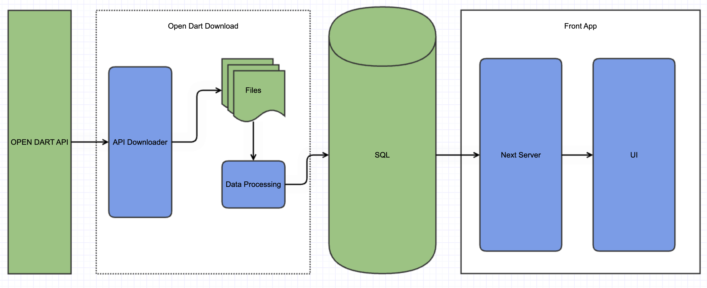

# financial-information-visualization

### 데모 링크

http://220.88.48.34:3000/

## 개요

해당 프로젝트는 [open dart](https://opendart.fss.or.kr/) 의 openAPI를 이용해 국내 회사 상장사들의 재무제표를 수집하고, 수집한 데이터를 손쉽게 제공하고자 만든 프로젝트입니다.

데이터를 제공하는 방식은 다음과 같습니다.

- 차트 시각화
- 데이터 파일 (csv 등)

## 동기

[dart](https://dart.fss.or.kr/) 를 통해 재무제표 데이터를 수집할 때 다음과 같은 문제에 부딪힙니다.

- 많은 보고서 조회: 4년치 재무제표 데이터를 수집하고자 한다면 16개(4년 x 4분기) 보고서를 조회해야함.
- 분기 상세 데이터 미제공: 2023년 이전 보고서는 3개월 단위 계정 값을 제공하지 않음.  
   ex) 반기 보고서는 당해 1~6월 매출액을 제공, 2분기(4~6월) 매출액을 얻기 위해선 (반기 보고서 매출액)에서 (1분기 보고서 매출액)을 빼주는 계산이 필요함.
- 복사/붙여넣기 수작업: html 테이블을 엑셀에 복사/붙여넣기 수작업하며 작업함.
- 기간별로 다른 계정명: 동일한 계정의 이름이 바뀌는 경우가 있음.  
   ex) 매출 => 수익(매출액)

## 프로젝트 구성

- open-dart-download: open dart 데이터 수집용 프로그램
- front-app: 수집된 데이터를 탐색/시각화용 프로그램

## 데이터 흐름도

